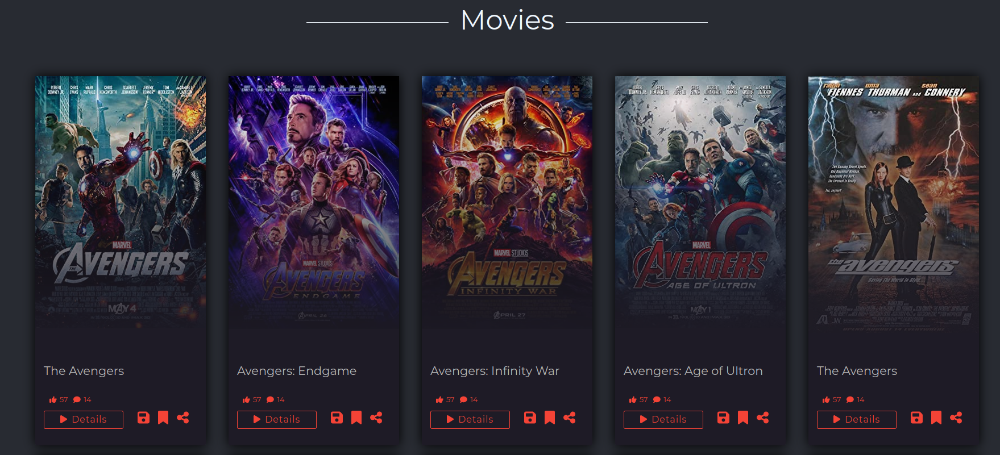

# MOVstrem App
MOVstrem App is a mobile web application that fetch data from an external API and display it in a mobile friendly way.
Users can search for movies and tv shows. The application is built with React and uses the following technologies:
    
## Built With

- HTML
- SCSS
- JavaScript
- React
- React Router
- Axios
- Redux Toolkit
- Redux-Persist
- React-Bootstrap
- React-Toastify

## Full Screen Views




  
## Learning objectives
- Use React documentation.
- Use React components.
- Use React props.
- Use React Router.
- Connect React and Redux.
- Handle events in a React app.
- Use styles in a React app.
- Use React life cycle methods.
- Apply React best practices and language style guides in code.
- Use store, actions and reducers in React.

## Instructions

First clone this repository.
```bash
$ git clone https://github.com/LuisSalas94/movie-app
```

Install dependencies. Make sure you already have [`nodejs`](https://nodejs.org/en/) & [`npm`](https://www.npmjs.com/) installed in your system.
```bash
$ npm install # or yarn
```

Run it
```bash
$ npm start # or yarn start
```

## Live Demo

[Live Demo Link](https://luissalas94.github.io/movie-app/)


## Author 👤

- GitHub: [@LuisSalas94](https://github.com/LuisSalas94)
- LinkedIn: [Fernando Salas](https://www.linkedin.com/in/luisfernandosalasgave/)
- Medium: [Fernando Salas](https://medium.com/@luisfernandosalasg)

## 🤝 Contributing

Contributions, issues, and feature requests are welcome!
Feel free to check the [issues page](../../issues/).

## Acknowledgments 📚 
Original design by [Nelson Sakwa on Behance](https://www.behance.net/sakwadesignstudio)

## Show your support

Give a ⭐️ if you like this project!

## 📝 License

This project is [MIT](./MIT.md) licensed.
